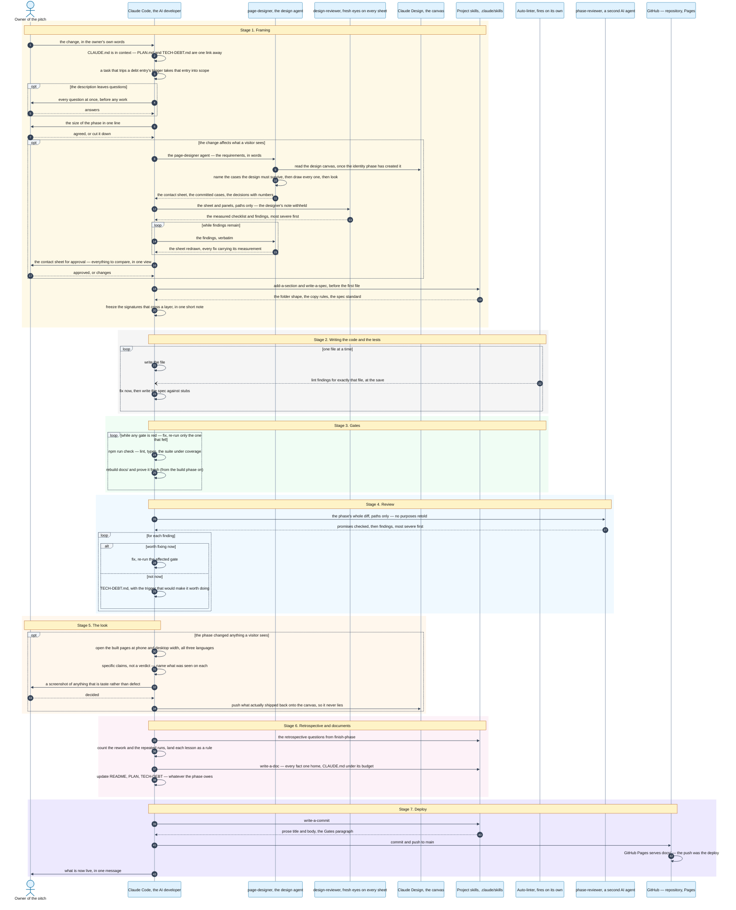

# How a change becomes a deploy

The site is developed by an AI agent — Claude Code, driven by the skills in
[`.claude/skills/`](.claude/skills/). This drawing is the map, not the
authority: each stage's rules live in the skill it names, and on any
disagreement the skill wins, then the drawing is fixed. A lesson from the
retrospective that changes a default redraws the step it touches in the same
commit, and the redraw is reported in the closing message with the numbers
that forced it — never made quietly. The colours are pinned so the forced dark
text stays readable in both of GitHub's themes.

Adapted from the FoolProof project's flow; what was dropped and why is at the
bottom, so a stage that returns can return deliberately.

## What the reference flow has that this one deliberately does not

- **Mutation and e2e gates, and the release tag with its pre-push battery** —
  a static demo deploys from `main` on every push; versioning the site would
  version nothing a visitor can name. [TECH-DEBT.md](TECH-DEBT.md) holds the
  triggers that would bring the missing gates back.
- **CI** — the local gates are the gate, as the reference's server deploy also
  trusts the local hook first. CI returns when the repository goes public on
  GitHub, in the launch phase.
